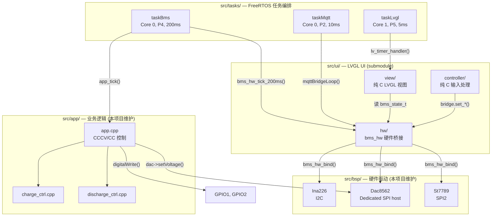
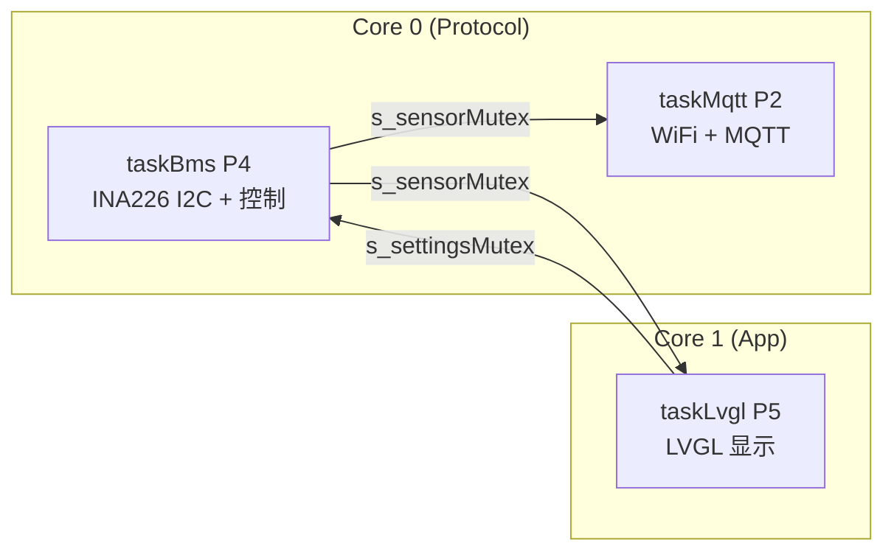
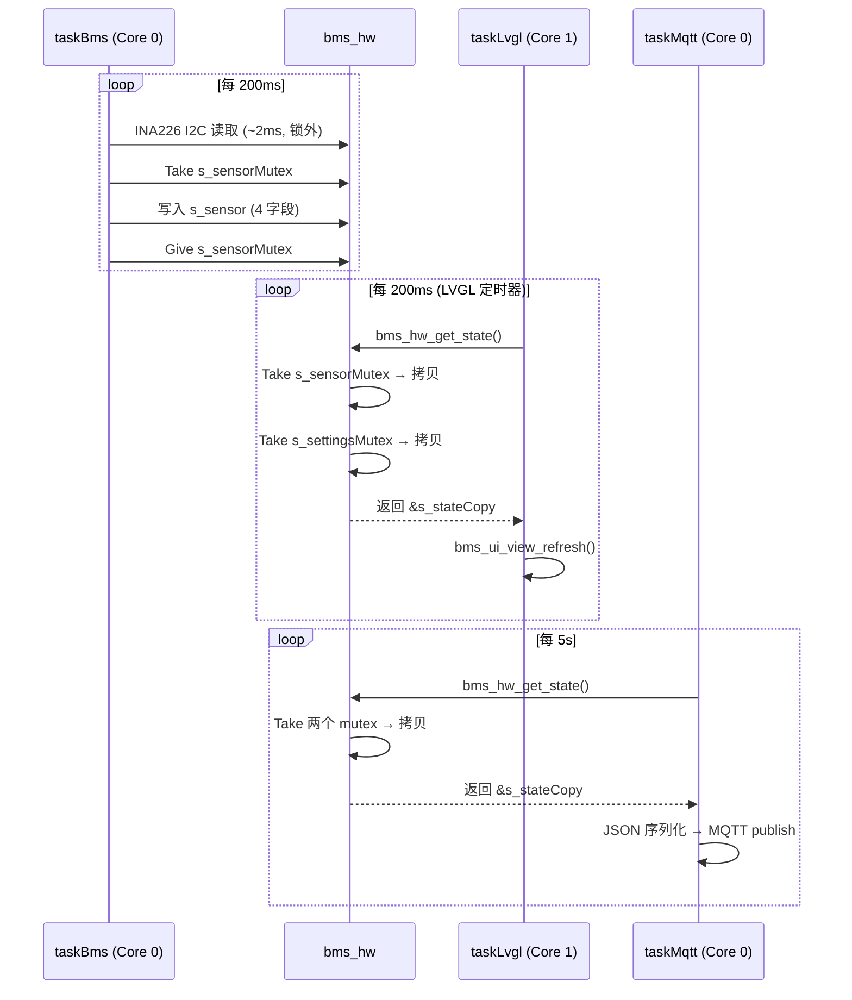
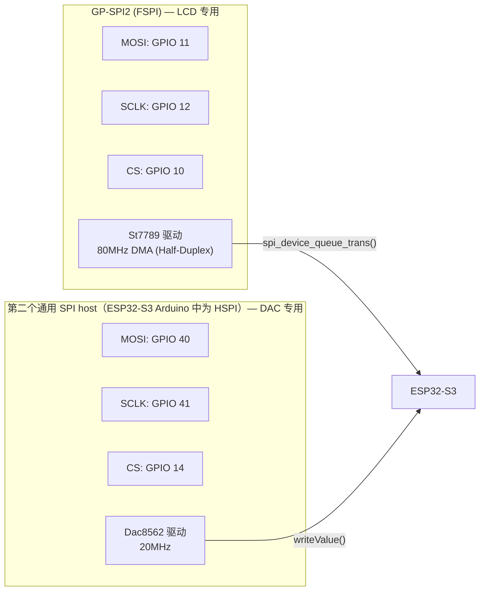
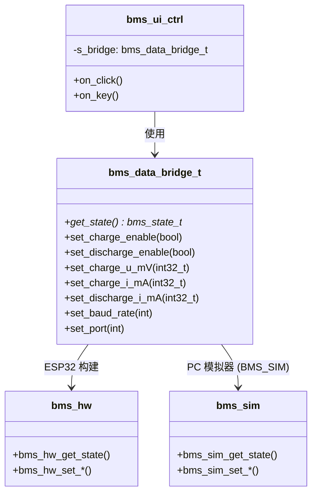
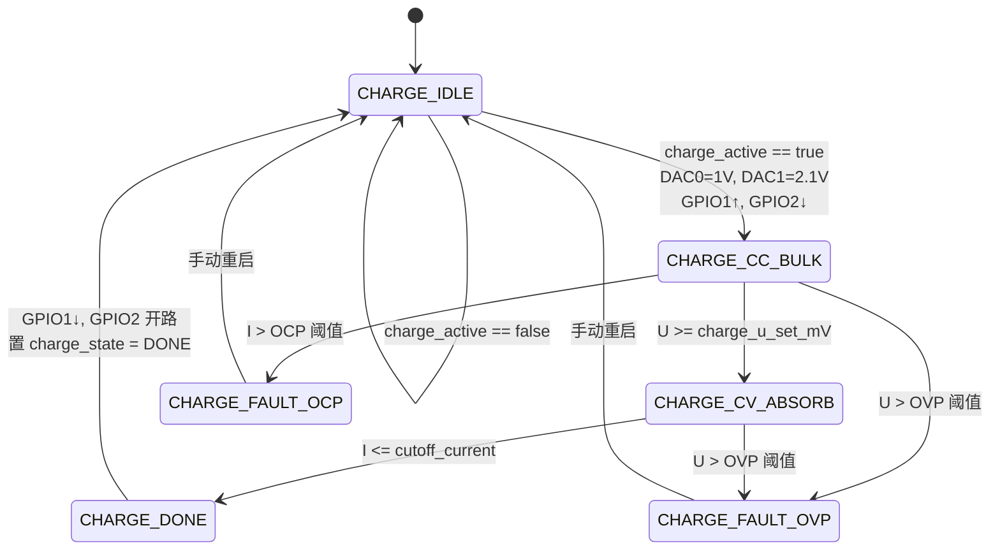
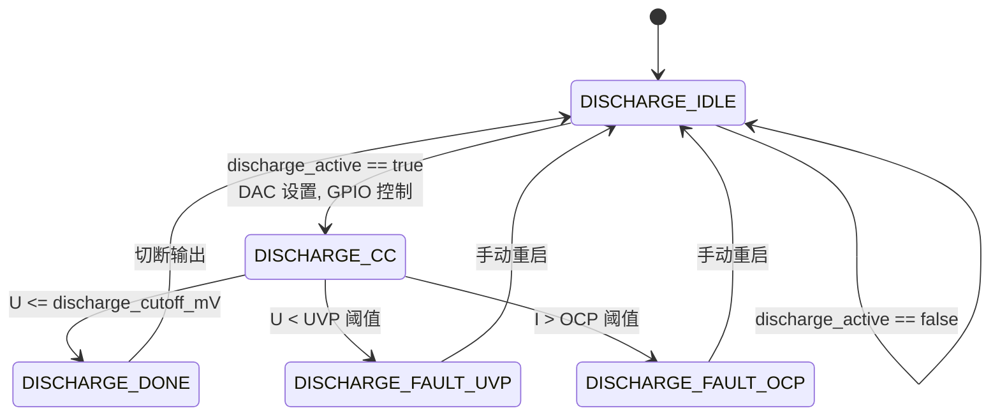
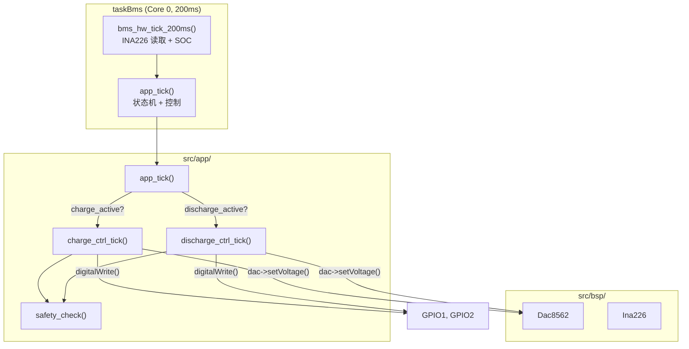

# BMSCoreESP32 系统架构

## 1. 系统总览

BMSCoreESP32 是 ESP32-S3 BMS 集成固件,采用三层架构:



---

## 2. FreeRTOS 任务

✅ **已实现**

| 任务 | 函数 | 核心 | 优先级 | 栈 | 周期 | 职责 |
|------|------|------|--------|-----|------|------|
| `taskLvgl` | `task_lvgl.cpp` | Core 1 | 5 (最高) | 8KB | 5ms | `lv_timer_handler()` — LVGL 渲染 + 定时器回调 |
| `taskBms` | `task_sensor.cpp` | Core 0 | 4 | 4KB | 200ms | `bms_hw_tick_200ms()` — INA226 读取 + SOC 查表 |
| `taskMqtt` | `task_mqtt.cpp` | Core 0 | 2 | 6KB | 10ms | `mqttBridgeLoop()` — WiFi/MQTT 维护 + 遥测 |

> `taskSensor` 将更名为 `taskBms`,职责扩展为: 传感器读取 + App 控制逻辑。

Arduino `loop()` 中 `vTaskDelay(portMAX_DELAY)` 永久挂起,所有工作由以上 3 个任务完成。

### 2.1 核心分配



- **Core 0**: I2C 传感器 + WiFi/MQTT 网络 (ESP32 默认 protocol core)
- **Core 1**: LVGL UI 独占,避免网络栈影响显示流畅度

### 2.2 LVGL 定时器

✅ **已实现**

在 `bms_ui_init()` 中注册,由 `taskLvgl` 的 `lv_timer_handler()` 驱动:

| 定时器 | 周期 | 回调 | 功能 |
|--------|------|------|------|
| `tick_200_cb` | 200ms | `bms_ui_view_refresh(BMS_GET_STATE())` | 更新 UI 显示 |
| `tick_1000_cb` | 1000ms | `bms_hw_tick_1000ms()` + refresh | 长周期任务 (当前为空) |

---

## 3. 同步机制

✅ **已实现**

### 3.1 双互斥锁

`bms_hw_init()` 创建两个 FreeRTOS 互斥锁 (带优先级继承):

```cpp
static SemaphoreHandle_t s_sensorMutex;    // 保护传感器数据
static SemaphoreHandle_t s_settingsMutex;  // 保护 UI 设置参数
```

### 3.2 数据流



### 3.3 设计要点

- I2C/SPI 等慢速操作在锁外执行,持锁时间极短 (~100ns 纯内存拷贝)
- 两个 mutex 独立保护不同数据,允许传感器和设置的并发读写
- `bms_hw_get_state()` 返回 static 指针,靠时序错开避免覆盖 (MQTT 10ms vs LVGL 200ms)

---

## 4. SPI 总线拓扑

✅ **已实现**

配套的 CubeMX 风格引脚可视化规范见 `Docs/PINOUT_VISUALIZATION.md`, 元数据见 `Docs/pinout_metadata.json`。

LCD 和 DAC 各自独占一条 SPI 总线,无总线冲突:



| 总线 | Arduino 别名 | 设备 | 频率 | CS 引脚 |
|------|-------------|------|------|---------|
| GP-SPI2 | `FSPI` | ST7789 LCD | 80MHz | GPIO 10 |
| 第二个通用 SPI host | `HSPI` on ESP32-S3 Arduino | DAC8562 | 20MHz | GPIO 14 |

每个驱动自行管理 `beginTransaction`/`endTransaction`,无共享状态。

---

## 5. Bridge 模式

✅ **已实现**

UI 层通过函数指针桥接访问硬件,实现零硬件依赖:



**编译时切换**: `#ifdef BMS_SIM` 将 bridge 映射到 `bms_sim_*` 函数,同一套 UI 代码可运行在 PC SDL2 模拟器上。

---

## 6. App 层控制架构

🔲 **Roadmap**

### 6.1 文件结构

```
src/app/
├── app.hpp / app.cpp              ← 总入口: init() + tick()
├── charge_ctrl.hpp / .cpp         ← 充电控制 (CCCV)
└── discharge_ctrl.hpp / .cpp      ← 放电控制 (CC)
```

### 6.2 充电状态机 (CCCV)



**状态转换表:**

| 当前状态 | 转换条件 | 下一状态 | 动作 |
|---------|---------|---------|------|
| IDLE | `charge_active == true` | CC_BULK | DAC0=1V, DAC1=2.1V, GPIO1↑, GPIO2↓ |
| CC_BULK | `U >= charge_u_set_mV` | CV_ABSORB | 切换到电压控制模式 |
| CC_BULK | `U > OVP 阈值` | FAULT_OVP | 紧急切断所有输出 |
| CC_BULK | `I > OCP 阈值` | FAULT_OCP | 紧急切断所有输出 |
| CV_ABSORB | `I <= cutoff_current` | DONE | GPIO1↓, GPIO2 开路 |
| CV_ABSORB | `U > OVP 阈值` | FAULT_OVP | 紧急切断所有输出 |
| DONE | — | IDLE | 自动回 IDLE |
| FAULT_* | 手动重启 | IDLE | 恢复初始状态 |

### 6.3 放电状态机 (CC)



### 6.4 状态枚举 (替代标志位)

`bms_state_t` 变更 — 用枚举替代 `charge_active` + `charge_auto_stopped`:

```cpp
// 充电状态
typedef enum {
    CHARGE_IDLE,           // 未充电
    CHARGE_CC_BULK,        // 恒流阶段
    CHARGE_CV_ABSORB,      // 恒压阶段
    CHARGE_DONE,           // 充满
    CHARGE_FAULT_OVP,      // 过压保护
    CHARGE_FAULT_OCP,      // 过流保护
} charge_state_t;

// 放电状态
typedef enum {
    DISCHARGE_IDLE,        // 未放电
    DISCHARGE_CC,          // 恒流放电
    DISCHARGE_DONE,        // 放完
    DISCHARGE_FAULT_UVP,   // 欠压保护
    DISCHARGE_FAULT_OCP,   // 过流保护
} discharge_state_t;
```

**状态机是唯一的写入者**,其他所有消费者 (UI、MQTT) 只读。

### 6.5 App 层函数签名

```cpp
// app.hpp
void app_init(void);
void app_tick(void);  // 每 200ms 被 taskBms 调用

// charge_ctrl.hpp
void charge_ctrl_init(void);
void charge_ctrl_start(void);   // 启动充电序列
void charge_ctrl_stop(void);    // 停止充电
void charge_ctrl_tick(const sensor_state_t* sensor, settings_state_t* settings);
charge_state_t charge_ctrl_get_state(void);

// discharge_ctrl.hpp
void discharge_ctrl_init(void);
void discharge_ctrl_start(void);
void discharge_ctrl_stop(void);
void discharge_ctrl_tick(const sensor_state_t* sensor, settings_state_t* settings);
discharge_state_t discharge_ctrl_get_state(void);
```

### 6.6 App 层调用链



---

## 7. 安全层

🔲 **Roadmap**

### 7.1 概述

安全层是横切关注点,在每次 `app_tick()` 中执行:

```
app_tick()
    ├─ charge_ctrl_tick() 或 discharge_ctrl_tick()   ← 主控制回路
    └─ safety_check(sensor)                          ← 每周期检查阈值
```

### 7.2 保护阈值

| 保护类型 | 检测方式 | 动作 | 响应时间 |
|---------|---------|------|---------|
| OVP (过压) | 软件: `U > OVP_mV` | 切断输出, 进入 FAULT_OVP | ≤200ms (轮询) |
| OCP (过流) | 软件: `I > OCP_mA` | 切断输出, 进入 FAULT_OCP | ≤200ms (轮询) |
| UVP (欠压) | 软件: `U < UVP_mV` | 置 low_volt_alert | ≤200ms (轮询) |
| OVP 硬件 | INA226 ALERT → GPIO 中断 | 立即切断 GPIO | <1ms |
| OCP 硬件 | INA226 ALERT → GPIO 中断 | 立即切断 GPIO | <1ms |

### 7.3 INA226 ALERT 中断 (安全兜底)

INA226 驱动已实现 `configureAlert()` 但未启用。计划接线:

```
INA226 ALERT → GPIO (待分配) → ESP32 外部中断
```

ISR 只做两件事:
1. 紧急切断 GPIO (直接 `digitalWrite`)
2. 置 fault_flag

**不做**: SPI 通信 (DAC 写入)、复杂判断。下一次 `app_tick()` 读取 flag 进入 FAULT 状态。

### 7.4 GPIO/DAC 映射

| 信号 | 功能 | 启动时 | 停止时 |
|------|------|--------|--------|
| DAC0 (Channel A) | 充电电流控制 | 1V | 0V |
| DAC1 (Channel B) | 充电电压控制 | 2.1V | 0V |
| GPIO1 | 充电启停信号 | LOW → HIGH | HIGH → LOW |
| GPIO2 | 充电使能/切断 | 开路 → LOW | LOW → 开路 |

> GPIO1/GPIO2 的逻辑编号对应 ESP32-S3 的 GPIO 编号,具体引脚待分配。

---

## 8. 已实现 vs Roadmap 总览

| 模块 | 状态 | 说明 |
|------|------|------|
| PlatformIO 构建 | ✅ | N16R8 板定义, Arduino 框架 |
| BSP: INA226 | ✅ | I2C 驱动, 完整寄存器访问, alert API 已实现未启用 |
| BSP: ST7789 | ✅ | SPI2 (FSPI) 专用, LVGL flush_cb |
| BSP: DAC8562 | ✅ | 第二个通用 SPI host 专用, 双通道 16-bit |
| bms_hw 桥接层 | ✅ | 双 mutex, 指针注入, bms_state_t |
| LVGL UI (4 页面) | ✅ | MVC 架构, bridge 模式, PC 模拟器兼容 |
| OCV-SOC 查表 | ✅ | LG 18650HG2, 13 点线性插值 |
| FreeRTOS 3 任务 | ✅ | 双核分配, 互斥锁保护 |
| MQTT 遥测 | ✅ | SmartConfig + 5s JSON 上报 |
| **App 层 (CCCV/CC 控制)** | 🔲 | 状态机、DAC 控制、GPIO 控制 |
| **安全层 (OVP/OCP/UVP)** | 🔲 | 阈值保护 + INA226 ALERT 中断 |
| **INA226 ALERT 中断** | 🔲 | configureAlert() 已实现,未接线 |
| **NTC 温度读取** | 🔲 | ADC 未实现 |
| **UART 主机通信** | 🔲 | 预留引脚,协议未实现 |
| **DL SOC 推理** | 🔲 | 1D-CNN 模型已训练,推理引擎未集成 |
| **WS2812 LED 状态指示** | ✅ | taskSystem 中轮询, 蓝绿双色闪烁 |
| **OneButton 配置重置** | ✅ | taskSystem 长按 3s 触发 SmartConfig |
