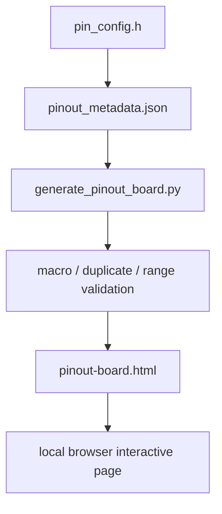
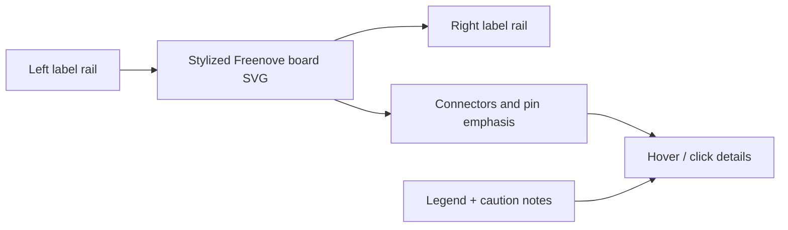

# Pinout Visualization Spec

## Summary

`BMSCoreESP32` now targets a board-style interactive pinout page rather than a purely abstract chip block.
The visual language follows the supplied reference style:

- board centered vertically
- left and right pin rails
- color-coded functional labels
- bottom legend and notes
- mode switching for full view and project-focused view

The implementation path is a generated static page:

- firmware truth: `include/pin_config.h`
- visualization metadata: [`pinout_metadata.json`](./pinout_metadata.json)
- generator: `scripts/generate_pinout_board.py`
- template: `scripts/pinout_board_template.html`
- generated output: `Docs/generated/pinout-board.html` (not committed)

## Source Model

### Source Layers

1. `include/pin_config.h`
   Runtime pin assignment truth.
2. `Docs/pinout_metadata.json`
   Visualization-facing data such as layout side, label text, project-use state, special badges, legend groups, and restricted ranges.
3. `scripts/generate_pinout_board.py`
   Validation and HTML generation.

The generator must validate metadata against `pin_config.h` and may synthesize free GPIO entries for the full view.

### Metadata Contract

Tracked GPIO entries include the original contract fields plus board-layout fields:

| Field | Meaning |
|------|---------|
| `gpio_number` | Physical GPIO number |
| `signal_name` | Signal or macro name |
| `short_label` | Compact rail label |
| `long_label` | Expanded detail text |
| `peripheral_group` | Logical function group |
| `render_group` | Render filter group |
| `status` | `used`, `reserved`, or synthesized `free` |
| `source_macro` | Macro name from `pin_config.h` |
| `view_color` | Color token |
| `side` | `left` or `right` rail |
| `order` | Vertical order within that rail |
| `is_project_used` | Whether project mode should emphasize it |
| `badge` / `display_badges` | Warning or state badges |

Additional page-level config lives under `page_config`:

- `output_path`
- `view_modes`
- `legend_groups`
- `board_style`
- `board_specials`
- `notes`

## Generation Flow



Run locally:

```bash
python3 scripts/generate_pinout_board.py
```

The script should:

- validate metadata against `pin_config.h`
- synthesize free GPIO entries for unlisted pins
- render a board-style static HTML page with embedded JSON data
- keep all interaction client-side with no external dependencies

## Visual Structure

### Layout

The page is intentionally poster-like instead of app-like:

- top: title and mode selector
- center: left rail, stylized board art, right rail
- bottom: legend, notes, and details panel

### Layer Model



### Board Art Direction

The board is a stylized SVG redraw, not a real-photo overlay.
It should include:

- PCB silhouette
- module area
- USB area
- button hints
- side pin pads

The art exists to orient the labels and mimic the reference composition, not to be a manufacturing drawing.

## Interaction Modes

The page must support these modes from metadata:

| Mode | Behavior |
|------|----------|
| `全量视图` | Show used, reserved, restricted, special, and synthesized free GPIOs together |
| `项目占用` | Emphasize all current project pins, including intentionally reserved UART and RGB LED |
| `SPI 高亮` | Emphasize LCD and DAC buses |
| `I2C 高亮` | Emphasize `GPIO21/22` |
| `受限引脚` | Emphasize reserved ranges and boot-sensitive pins |
| `可用 GPIO` | Emphasize synthesized free GPIOs and mute assigned/restricted ones |

Hover and click behavior:

- hover updates the detail card
- click locks the detail card on a pin or special item
- selected item remains emphasized until another selection or reset

## Full View vs Project View

### Full View

Full view is the “board poster” mode.
It should display:

- all explicit project pins
- restricted ranges `26-32` and `35-37`
- special board items such as `3.3V`, `5V`, `GND`, `BOOT`
- synthesized free GPIOs in muted style

### Project View

Project view is the default development-aid mode.
It should:

- highlight current project-used or intentionally reserved pins
- mute synthesized free GPIOs
- keep restriction warnings visible but secondary

## Validation Rules

Generation fails when:

- a pin macro in `pin_config.h` is missing from metadata
- metadata references a `source_macro` not present in `pin_config.h`
- duplicate GPIO assignments exist in tracked pins
- a tracked pin falls inside a restricted range

Generation warns when:

- `GPIO0` is missing a boot-sensitive badge
- a reserved pin is marked as project-used but lacks explanatory notes

## Current Minimum Coverage

The page must at least represent:

- I2C: `21`, `22`
- LCD: `8`, `9`, `10`, `11`, `12`, `46`
- DAC: `14`, `40`, `41`
- UART reserved: `17`, `18`
- system pins: `0`, `48`
- restricted ranges: `26-32`, `35-37`

## Output and Git Policy

Generated artifacts are intentionally excluded from Git.
Only these sources are committed:

- metadata JSON
- generator script
- HTML template
- documentation updates

This keeps the repository reviewable while still allowing anyone to regenerate the page locally.
