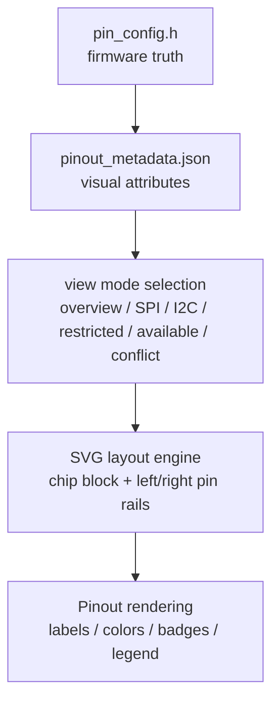
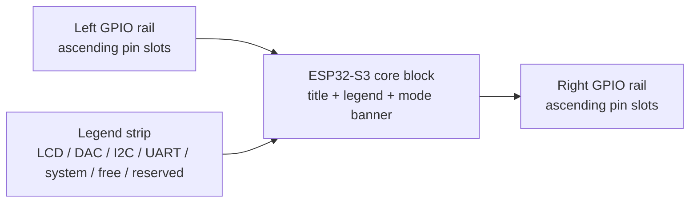

# Pinout Visualization Spec

## Summary

This document defines a CubeMX-style pin visualization for `BMSCoreESP32`.
The first version is a documentation-grade design spec, not a full interactive tool.
It uses:

- `include/pin_config.h` as the hardware source of truth
- [`pinout_metadata.json`](./pinout_metadata.json) as the visualization metadata layer
- Mermaid for structure and state explanation
- SVG layout rules as the intended rendering target for a future HTML/SVG prototype

The visual style is an abstract chip/logical view rather than a photo-real board overlay.

## Source Model

### Single Source of Truth

The visualization flow is intentionally split in two layers:

1. `include/pin_config.h`
   Hardware allocations owned by firmware.
2. `Docs/pinout_metadata.json`
   Visualization-only attributes such as color, badges, reserved ranges, and default rendering rules.

This keeps firmware pin assignment authoritative while avoiding UI-specific metadata in runtime code.

### Metadata Contract

Each explicitly tracked pin entry should include at least:

| Field | Meaning |
|------|---------|
| `gpio_number` | Physical GPIO number shown in the visual map |
| `signal_name` | Human-readable signal or macro name |
| `peripheral_group` | Functional group such as `LCD`, `DAC`, `I2C0`, `UART` |
| `status` | Render state such as `used`, `reserved`, `free` |
| `notes` | Tooltip/details-panel description |
| `source_macro` | Macro name from `pin_config.h` |
| `view_color` | Visual palette token |

Additional optional fields for warnings or UX:

- `direction`
- `display_badges`
- `restricted_ranges`
- `view_modes`

### Rendering Defaults

Unlisted GPIOs render as `free` by default in v1.
That default is deliberate: the repository currently documents explicit assignments and explicit restricted ranges, but does not yet maintain a fully enumerated board-wide GPIO capability matrix.

## Visual Structure

### Layer Model



### Abstract Canvas Layout



### V1 Mermaid Prototype

```mermaid
flowchart LR
    subgraph LEFT["Left GPIO Rail"]
        L0["GPIO0<br/>FLASH_BTN"]
        L8["GPIO8<br/>LCD_BLK"]
        L9["GPIO9<br/>LCD_RST"]
        L10["GPIO10<br/>LCD_CS"]
        L11["GPIO11<br/>LCD_MOSI"]
        L12["GPIO12<br/>LCD_SCLK"]
        L14["GPIO14<br/>DAC_SYNC"]
        L17["GPIO17<br/>UART_TX"]
        L18["GPIO18<br/>UART_RX"]
        L21["GPIO21<br/>I2C_SDA"]
        L22["GPIO22<br/>I2C_SCL"]
    end

    CHIP["ESP32-S3<br/>BMSCoreESP32<br/>Abstract Pin View"]

    subgraph RIGHT["Right GPIO Rail"]
        R26["GPIO26-32<br/>Flash/PSRAM reserved"]
        R35["GPIO35-37<br/>OPI PSRAM occupied"]
        R40["GPIO40<br/>DAC_MOSI"]
        R41["GPIO41<br/>DAC_SCLK"]
        R46["GPIO46<br/>LCD_DC"]
        R48["GPIO48<br/>RGB_LED"]
        RFREE["Other documented-unlisted GPIOs<br/>render as free in v1"]
    end

    LEFT --> CHIP
    CHIP --> RIGHT

    classDef lcd fill:#2f6fed,color:#ffffff,stroke:#1b3f8b,stroke-width:2px;
    classDef dac fill:#f28c28,color:#111111,stroke:#9a4d00,stroke-width:2px;
    classDef i2c fill:#2ea043,color:#ffffff,stroke:#1d6b2b,stroke-width:2px;
    classDef uart fill:#1fb6c9,color:#0b2530,stroke:#0a6875,stroke-width:2px;
    classDef system fill:#d73a49,color:#ffffff,stroke:#8a1f29,stroke-width:2px;
    classDef reserved fill:#6b7280,color:#ffffff,stroke:#374151,stroke-width:2px;
    classDef free fill:#d1d5db,color:#111827,stroke:#6b7280,stroke-dasharray: 5 3;
    classDef chip fill:#111827,color:#f9fafb,stroke:#4b5563,stroke-width:3px;

    class L8,L9,L10,L11,L12,R46 lcd;
    class L14,R40,R41 dac;
    class L21,L22 i2c;
    class L17,L18 uart;
    class L0,R48 system;
    class R26,R35 reserved;
    class RFREE free;
    class CHIP chip;
```



### SVG-Oriented Layout Rules

Use these dimensions as the baseline for a first SVG or HTML prototype:

| Element | Baseline |
|--------|----------|
| Canvas | `1600 x 900` |
| Central chip block | `360 x 620` centered |
| Left and right rails | Equal width columns flanking the chip block |
| Pin slot height | `24px` |
| Pin slot vertical gap | `6px` |
| Label area | `GPIOxx` + signal label + optional badges |
| Legend position | Top-center or top-right of central block |

Recommended ordering:

- Left rail: lower-numbered GPIOs first
- Right rail: continue numbering in ascending order
- Restricted ranges remain visible in-place instead of being hidden
- Unlisted pins render as free placeholders with subdued labels

## Color and Status Rules

### Palette Tokens

| Token | Meaning | Suggested Style |
|------|---------|-----------------|
| `lcd` | LCD / FSPI-connected display pins | Bright blue |
| `dac` | DAC / second SPI host pins | Orange |
| `i2c` | I2C sensor pins | Green |
| `uart` | Reserved UART pins | Cyan |
| `system` | Buttons, LEDs, boot-sensitive pins | Red or amber |
| `free` | Available and unassigned | Neutral slate |
| `reserved` | Unavailable due to board/memory constraints | Dark gray |
| `warning` | Badge overlay for caution | Yellow |

### Status Semantics

| Status | Render Rule |
|--------|-------------|
| `used` | Full saturation, visible signal label |
| `reserved` | Gray or muted fill, show reason in details |
| `free` | Neutral fill, no signal binding |
| `used + boot/input-sensitive badge` | Full saturation plus warning badge |

GPIO `0` must always display a caution badge because it is both assigned and boot-sensitive.

## View Modes

The metadata and eventual renderer should support these states:

| View Mode | Behavior |
|----------|----------|
| `overview` | Show all assigned pins, restrictions, and free pins together |
| `spi-highlight` | Emphasize LCD + DAC buses, mute everything else |
| `i2c-highlight` | Emphasize `GPIO 21/22`, mute everything else |
| `restricted` | Emphasize reserved ranges and warning pins |
| `available-gpio` | Emphasize unassigned pins, keep used/reserved muted |
| `conflict-check` | Highlight duplicate assignments or missing metadata if present |

For v1 documentation, these modes are conceptual states.
For v2 HTML/SVG, they become filter buttons or tabs.

## Labeling Rules

Every visible assigned pin should show:

- `GPIOxx`
- the primary signal label
- the peripheral group color

Optional secondary information:

- macro name from `pin_config.h`
- bus alias such as `FSPI`, `HSPI`
- badges such as `boot`, `input-sensitive`, `reserved`

Compact label format for rail slots:

```text
GPIO21  SDA
GPIO22  SCL
GPIO10  LCD_CS
GPIO14  DAC_SYNC
```

Expanded details panel format for a future interactive renderer:

```text
GPIO21
Signal: PIN_I2C_SDA
Group: I2C0
Status: used
Notes: INA226 SDA on I2C0 at 400kHz
```

## Current Project Mapping

The current visualization must at minimum cover these explicitly tracked project pins:

| Group | GPIOs |
|------|-------|
| I2C0 | `21`, `22` |
| LCD / FSPI | `8`, `9`, `10`, `11`, `12`, `46` |
| DAC / second SPI host | `14`, `40`, `41` |
| UART reserved | `17`, `18` |
| System | `0`, `48` |
| Restricted | `26-32`, `35-37` |

## Conflict and Validation Rules

The visualization pipeline should fail validation when:

- one GPIO is bound to multiple active signal entries
- a signal exists in `pin_config.h` but not in `pinout_metadata.json`
- a metadata pin references a macro not present in `pin_config.h`
- a restricted GPIO is also marked as free

The pipeline should warn, but not fail, when:

- a pin is intentionally reserved but not yet initialized in runtime code
- a warning badge is required but missing

## Next Phase Contract

If this evolves into a local tool, prefer:

- static HTML
- inline SVG for exact pin placement
- JSON-driven rendering from `pinout_metadata.json`
- mode buttons for `overview`, `SPI`, `I2C`, `restricted`, and `available`

The renderer should treat `pinout_metadata.json` as the only visualization input layer and should not parse prose from Markdown documents.
