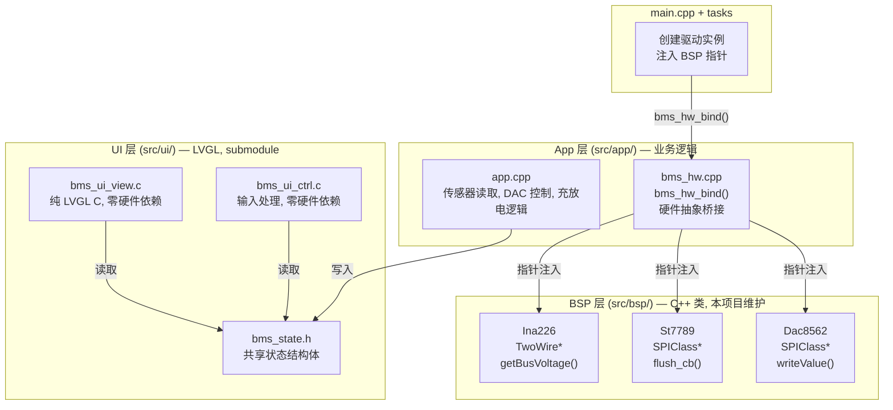

# BMSCoreESP32 项目规格书

## 1. 概述

ESP32-S3 BMS 集成固件,整合以下子系统:
- **BMS 核心**: INA226 电流/电压监测 + DAC8562 模拟输出 + ST7789 LCD 显示
- **LVGL UI**: 4 页面 MVC 界面 (SOC 显示, CCCV 充电, CC 放电, 系统设置)
- **MQTT 遥测**: WiFi 连接 + MQTT 数据上报 (电压/电流/SOC/温度)
- **SOC 估算**: OCV-SOC 查找表 (LG 18650HG2, 13 点线性插值)

### 1.1 源项目关系

本项目的代码来源:
- **BMS-Core/** — 业务逻辑 (`App/Src/app.cpp`) + BSP 驱动 (`BSP/`) + UI 子模块 (`App/lvgl-bms-view/`)
- **lv_port_pc_vscode/** — PC 模拟器,复用同一套 lv_bms_view UI 代码,额外提供 SDL2 渲染适配
- **UART-MQTT-Trans/** — ESP32 MQTT 桥接 sketch
- **DL/** — Python SOC 模型训练 (暂不集成)

**重要**: App (业务逻辑) 和 UI (lv_bms_view) 是独立的,参照 BMS-Core 的做法:

```
BMS-Core 的分层:
├── App/Src/app.cpp          ← 业务逻辑 (传感器读取, DAC控制, 充放电)
├── App/lvgl-bms-view/       ← UI 子模块 (view+controller+hw+fonts) ← 独立于业务逻辑
├── BSP/                     ← BSP 驱动
└── Middlewares/lvgl/        ← LVGL

BMSCoreESP32 的分层:
├── src/app/app.cpp          ← 业务逻辑 (本项目维护, 非 submodule)
├── src/ui/                  ← UI 子模块 (git submodule: lv_bms_view)
├── src/bsp/                 ← BSP 驱动 (本项目维护, 非 submodule)
└── middleware/lvgl/         ← LVGL (git submodule)
```

子模块分支策略 (新建 ESP32 专用分支,不复用 F103 分支):
```
LVGL:      lvgl/lvgl → release/v9.5 → 新建 dev-esp32/v9.5
lv_bms_view: Railgun-wiki/lv_bms_view → master → 新建 dev-esp32
FreeRTOS:  FreeRTOS/FreeRTOS-Kernel → main
```

---

## 2. 编码规范

### 2.1 语言标准
- **C++17**: BSP 驱动、业务逻辑、main.cpp、tasks
- **C11**: LVGL view/controller 层 (纯 C, `extern "C"` 链接)
- 禁止在嵌入式环境中使用异常 (exceptions) 和 RTTI
- 使用 `nullptr` 代替 `NULL`
- 优先使用 `enum class` (强类型枚举)
- 合理使用 `const` / `constexpr`
- 避免动态内存分配 (new/delete),优先使用静态分配或 FreeRTOS heap

### 2.2 命名约定
| 类型 | 风格 | 示例 |
|------|------|------|
| 类名 | PascalCase | `Ina226`, `St7789`, `Dac8562` |
| 成员函数 | camelCase | `getBusVoltage_mV()`, `writeValue()` |
| 公有变量 | camelCase | `voltage_mV`, `current_mA` |
| 私有成员 | `m_` 前缀 | `m_hi2c`, `m_address` |
| 宏/常量 | 全大写+下划线 | `INA226_ADDRESS`, `PIN_I2C_SDA` |
| FreeRTOS 任务函数 | camelCase | `taskLvgl()`, `taskSensor()` |
| 文件名 (C++) | 小写+下划线 | `ina226.cpp`, `lv_port_disp.cpp` |
| 文件名 (C) | 小写+下划线 | `bms_ui_view.c`, `bms_ui_ctrl.c` |

### 2.3 三层解耦

**核心原则**: BSP、App、UI 三层独立,通过接口连接。



**规则**:

1. **BSP 驱动** (`src/bsp/`): C++ 类,构造函数接收外设句柄指针
   - 不依赖 App 或 UI 的任何头文件
   - 可独立编译和测试

2. **App 业务逻辑** (`src/app/`): 本项目维护的源码 (非 submodule)
   - `app.cpp`: 传感器读取、DAC 控制、充放电算法
   - 通过 `bms_hw_bind()` 在运行时注入 BSP 驱动指针
   - 不直接 `#include` BSP 头文件 (前向声明 + 指针)

3. **UI 层** (`src/ui/`): lv_bms_view submodule
   - view/controller: 纯 C + LVGL API,零硬件依赖
   - hw/: 桥接层,通过 `bms_hw.h` 接口读写硬件
   - 通过 `bms_state_t` 获取数据,不依赖 App 或 BSP
   - 可在 PC 模拟器 (lv_port_pc_vscode) 直接复用

4. **连接方式**: App 写入 `bms_state_t`,UI 读取 `bms_state_t`
   ```cpp
   // main.cpp: 创建驱动并注入
   TwoWire wireI2C(0);
   Ina226 ina226(&wireI2C, 0x40);
   bms_hw_bind(&ina226, &dac8562);
   bms_ui_init();  // UI 初始化
   ```

5. **tasks**: 编排层,调用 App 和 UI 接口

### 2.4 目录规范

| 目录 | 内容 | 语言 | 外部依赖 | 维护者 |
|------|------|------|----------|--------|
| `src/bsp/` | 硬件驱动 | C++ | Arduino Wire/SPI | 本项目 |
| `src/app/` | 业务逻辑 | C++ | BSP 指针 | 本项目 (非 submodule) |
| `src/ui/src/view/` | LVGL UI 视图 | C | LVGL only | lv_bms_view submodule |
| `src/ui/src/controller/` | UI 控制器 | C | LVGL + bms_state.h | lv_bms_view submodule |
| `src/ui/src/hw/` | 硬件抽象桥接 | C++ | bms_hw.h 接口 | lv_bms_view submodule |
| `src/ui/fonts/` | 自定义字体 | C | LVGL | lv_bms_view submodule |
| `src/tasks/` | FreeRTOS 任务 | C++ | FreeRTOS, 各模块 | 本项目 |
| `src/mqtt/` | MQTT 遥测 | C++ | WiFi, PubSubClient | 本项目 |
| `src/soc/` | SOC 估算 | C | 无 | 本项目 |
| `middleware/lvgl/` | LVGL 源码 | C | submodule | 上游 (lvgl/lvgl) |
| `middleware/FreeRTOS/` | FreeRTOS-Kernel | C | submodule | 上游 |
| `boards/` | 自定义板定义 | JSON | PlatformIO | 本项目 |
| `include/` | 全局头文件 | C/C++ | 无 | 本项目 |
| `Docs/` | 项目文档 | Markdown | 无 | 本项目 |
| `scripts/` | 工具脚本 | Python | 无 | 本项目 |

### 2.5 头文件规范
- 新代码使用 `#pragma once`
- 存量代码保留 `#ifndef` 守卫,不强制迁移
- 头文件路径使用相对于 `include_dirs` 的路径,不使用 `../` 相对路径

### 2.6 注释规范
- 公共 API: Doxygen 风格 (`@brief`, `@param`, `@return`)
- 行内注释: 仅解释 **为什么** (WHY),不解释 **是什么** (WHAT)
- 禁止注释掉的代码 (使用 git 历史追溯)
- 文件头: 可选标注作者/日期

### 2.7 错误处理
- BSP 驱动: 返回 `bool` 表示成功/失败,不抛异常
- 初始化失败: 在 `setup()` 中检查,失败则进入错误状态 (LED 闪烁)
- 运行时错误: 记录日志,尽量降级运行

---

## 3. 目标硬件

| 项目 | 规格 |
|------|------|
| MCU | ESP32-S3 Xtensa LX7, 240MHz 双核 |
| Flash | **16MB** (N16R8) |
| PSRAM | 8MB OPI |
| Display | 1.14" ST7789 IPS, 135x240, RGB565, SPI |
| Sensor | INA226, I2C, 2mOhm 分流器, 最大 15A |
| DAC | DAC8562, 双通道 16-bit，第二个通用 SPI host 独立总线 |
| WiFi | ESP32-S3 内置 2.4GHz 802.11 b/g/n |
| RGB LED | WS2812, GPIO 48 |

### 3.1 自定义板定义
PlatformIO 仓库仅有 N8R8 板定义。N16R8 需要自定义:
- 文件: `boards/freenove_esp32_s3_wroom_n16r8.json`
- 差异: `flash_size: 16MB`, `maximum_size: 16777216`, `partitions: default_16MB.csv`

---

## 4. 引脚分配


### 4.1 I2C (INA226)
| 信号 | GPIO | 备注 |
|------|------|------|
| SDA | 21 | I2C0 |
| SCL | 22 | I2C0, 400kHz |

### 4.2 SPI — ST7789 (GP-SPI2 / FSPI, LCD 专用)
| 信号 | GPIO | 备注 |
|------|------|------|
| MOSI | 11 | LCD 数据 |
| SCLK | 12 | LCD 时钟 |
| LCD_CS | 10 | ST7789 片选 |
| LCD_DC | 46 | ST7789 数据/命令 |
| LCD_RST | 9 | ST7789 复位 |
| LCD_BLK | 8 | ST7789 背光 |

### 4.2.1 SPI — DAC8562（第二个通用 SPI host，DAC 专用）
| 信号 | GPIO | 备注 |
|------|------|------|
| DAC_MOSI | 40 | DAC 数据 |
| DAC_SCLK | 41 | DAC 时钟 |
| DAC_SYNC | 14 | DAC8562 片选 |

### 4.3 其他
| 信号 | GPIO | 备注 |
|------|------|------|
| UART_RX | 18 | 预留 |
| UART_TX | 17 | 预留 |
| RGB_LED | 48 | WS2812 状态指示 |
| FLASH_BTN | 0 | WiFiManager 配置重置 |

### 4.4 约束
- GPIO 35-37 被 OPI PSRAM 占用,不可用
- GPIO 0 为 boot 按键,仅作输入
- GPIO 26-32 保留给 Flash/PSRAM

---

## 5. FreeRTOS 任务架构

| 任务 | 核心 | 优先级 | 栈大小 | 周期 | 功能 |
|------|------|--------|--------|------|------|
| task_lvgl | 1 | 5 (最高) | 8KB | 5ms | lv_timer_handler(), 显示刷新 |
| task_sensor | 0 | 4 | 4KB | 200ms | INA226 V/I 读取, SOC 查表 |
| task_mqtt | 0 | 2 | 6KB | 10ms | WiFi/MQTT 维护, 遥测上报 |

### 5.1 核心分配策略
- **Core 1**: LVGL 独占,避免 WiFi/MQTT 栈占用影响显示流畅度
- **Core 0**: 传感器 + 网络,Arduino WiFi 默认使用 Core 0

### 5.2 共享状态保护
- `bms_state_t` 通过 `SemaphoreHandle_t` 互斥锁保护
- sensor 任务写入,LVGL timer 回调和 MQTT 任务读取
- LVGL UI 更新仅在 `lv_timer_handler()` 内部的 timer 回调中执行

---

## 6. LVGL 配置

`lv_conf.h` 来源: `src/ui/lv_conf.h` (lv_bms_view submodule),复制到项目根目录供 LVGL 库查找。
针对 ESP32 需要修改: `LV_USE_OS=LV_OS_FREERTOS`, `LV_MEM_SIZE=32768`, 删除 `BMS_SIM` 条件块。

| 参数 | 值 | 备注 |
|------|-----|------|
| LV_COLOR_DEPTH | 16 | RGB565 |
| LV_USE_OS | LV_OS_FREERTOS | 使用 FreeRTOS 互斥 |
| LV_MEM_SIZE | 32768 | 32KB LVGL 内部堆 |
| LV_DRAW_BUF_STRIDE_ALIGN | 4 | ESP32 DMA 对齐 |
| LV_DRAW_SW_COMPLEX | 1 | 启用圆角/阴影 |
| LV_USE_DRAW_SW | 1 | 软件渲染 |
| 自定义字体 | montserrat_12_subset, montserrat_28_subset | 子集字体 |
| 启用控件 | button, label, line | 最小化内存占用 |

### 6.1 显示缓冲
- 部分渲染模式,5 行缓冲: `240 * 5 * 2 = 2400 字节`
- 双缓冲提升性能

---

## 7. MQTT 遥测协议

### 7.1 Topic 设计
| Topic | 方向 | 格式 | 周期 |
|-------|------|------|------|
| `bms/telemetry` | 上报 | JSON | 5 秒 |
| `bms/command` | 下发 | JSON | 按需 |

### 7.2 遥测数据格式
```json
{
  "v_mv": 3700,
  "i_ma": 1500,
  "soc_x10": 850,
  "temp_x10": 250,
  "charge_active": true,
  "discharge_active": false
}
```

### 7.3 WiFi 配置
- WiFiManager captive portal (AP 模式配置)
- AP 名称: `ESP32S3_BMS`
- 长按 FLASH 按钮 (>3s) 擦除 WiFi 配置
- 配置存储: LittleFS `/config`

---

## 8. SOC 估算

### 8.1 OCV-SOC 查找表 (LG 18650HG2)
13 个标定点,线性插值:
- 2.500V → 0% ~ 4.200V → 100%
- 纯 C 整数运算 (mV 输入, x10% 输出)

### 8.2 DL 模型 (未来)
- 1D-CNN 已训练 (`DL/checkpoints/best_model.pth`)
- float32 推理 (~1.6MB 权重, PSRAM 可容纳)
- 权重提取脚本: `scripts/export_weights.py`

---

## 9. 构建配置

### 9.1 PlatformIO
```ini
[env:freenove_esp32_s3_wroom_n16r8]
platform = espressif32
board = freenove_esp32_s3_wroom_n16r8
board_build.filesystem = littlefs
framework = arduino

build_flags =
    -DBOARD_HAS_PSRAM
    -DLV_CONF_INCLUDE_SIMPLE
    -DBMS_ESP32
    -std=gnu++17
```

### 9.2 依赖库
| 库 | 版本 | 来源 |
|----|------|------|
| LVGL | v9.5 | middleware/lvgl/ submodule (lvgl/lvgl, 从 release/v9.5 新建 dev-esp32/v9.5) |
| lv_bms_view | master | src/ui/ submodule (Railgun-wiki/lv_bms_view, 新建 dev-esp32) |
| FreeRTOS-Kernel | latest | middleware/FreeRTOS/ submodule |
| ArduinoJson | ^7 | lib_deps |
| OneButton | ^2 | lib_deps |
| PubSubClient | ^2 | lib_deps |
| WiFiManager | v2.0.17 | lib_deps |

### 9.3 条件编译宏
| 宏 | 含义 |
|----|------|
| `BMS_ESP32` | ESP32-S3 目标 |
| `BMS_SIM` | PC SDL 模拟器 (不用于此项目) |
| `BOARD_HAS_PSRAM` | 启用 PSRAM 支持 |
| `LV_CONF_INCLUDE_SIMPLE` | lv_conf.h 查找模式 |

---

## 10. Git 工作流

### 10.1 Submodule 清单
| 路径 | 远程 | 基线 | 新建分支 |
|------|------|------|----------|
| `middleware/lvgl` | github.com/lvgl/lvgl.git | release/v9.5 | `dev-esp32/v9.5` |
| `src/ui/` | github.com/Railgun-wiki/lv_bms_view.git | master | `dev-esp32` |
| `middleware/FreeRTOS` | github.com/FreeRTOS/FreeRTOS-Kernel.git | main | (直接用 main) |

**注意**: 不使用 `dev-f103/v9.5` (LVGL) 和 `opt-f103` (lv_bms_view),这些是 F103 的大幅精简优化分支,ESP32 需要从基线重新优化。

### 10.2 分支策略
- `main` — 稳定版本,可编译可运行
- `feature/<描述>` — 新功能开发
- `fix/<描述>` — 修复
- submodule 内部: 从基线新建 `dev-esp32` 分支

### 10.3 Submodule 新建 ESP32 分支
```bash
# LVGL: 从 release/v9.5 新建 ESP32 分支
cd middleware/lvgl
git fetch origin
git checkout -b dev-esp32/v9.5 origin/release/v9.5
git push origin dev-esp32/v9.5

# lv_bms_view: 从 master 新建 ESP32 分支
cd src/ui
git fetch origin
git checkout -b dev-esp32 origin/master
git push origin dev-esp32
```

### 10.3.1 Sparse Checkout (lv_bms_view)
`lv_bms_view` 仓库派生自 `lv_port_pc_vscode`,包含 PC 模拟器代码 (SDL2、hal、sim 等)。
嵌入式构建只需 UI 层代码,必须使用 sparse checkout 避免检出无关文件:

```bash
./scripts/setup-sparse-checkout.sh
```

**检出** (嵌入式需要):
- `src/view/`, `src/controller/`, `src/hw/` — MVC UI 层
- `fonts/` — 自定义 Montserrat 子集字体
- `src/bms_state.h`, `src/bms_ui.h`, `src/bms_ui.cpp` — 接口定义
- `lv_conf.h` — LVGL 配置

**排除** (PC 模拟器相关):
- `src/main.c`, `src/hal/`, `src/sim/`, `src/freertos/` — PC 模拟器入口和适配层
- `docs/` — 文档
- `lvgl/`, `FreeRTOS/` — 已在 `middleware/` 中独立管理

### 10.4 Submodule 修改流程
```bash
# 1. 主仓库创建分支
git checkout -b feature/add-chart-widget

# 2. 进入 submodule 修改 (已在 dev-esp32 分支上)
cd src/ui
# ... 修改 ...
git add -A && git commit -m "feat: add chart widget"
cd ../..

# 3. 主仓库更新 submodule 引用
git add src/ui
git commit -m "feat: update ui submodule for chart widget"
```

### 10.4 提交规范
- **每次工作结束后必须提交 git**
- **每 3 次提交需更新文档** (CLAUDE.md, Docs/PROJECT_SPEC.md)
- 提交信息格式: `<type>: <description>`
  - `feat`: 新功能
  - `fix`: 修复
  - `refactor`: 重构
  - `docs`: 文档
  - `chore`: 构建/配置

---

## 11. 开发路线图

### Phase 1: 基础框架 ✅
- [x] 自定义板定义 (N16R8)
- [x] platformio.ini + lv_conf.h
- [x] middleware submodule: LVGL (dev-esp32/v9.5) + FreeRTOS
- [x] UI submodule: lv_bms_view (dev-esp32 + sparse checkout)
- [x] BSP 驱动移植 (INA226, ST7789, DAC8562)
- [x] LVGL 显示初始化

### Phase 2: BMS UI + 业务逻辑 ✅
- [x] bms_hw.cpp 适配 (Wire/SPI handle, 双 mutex)
- [x] 4 页面 UI 渲染
- [x] Bridge 模式 (bms_data_bridge_t)
- [x] SPI 总线分离 (FSPI→LCD, 第二个通用 SPI host→DAC)

### Phase 3: 传感器集成 ✅
- [x] INA226 数据读取
- [x] OCV-SOC 查表
- [x] bms_state_t 更新

### Phase 4: MQTT 遥测 ✅
- [x] WiFiManager 配置
- [x] MQTT 连接 + 遥测上报 (5s JSON)

### Phase 5: DL SOC 推理 (未来)
- [ ] 权重提取脚本
- [ ] C 推理引擎

### Phase 6: CCCV/CC 控制 🔲
- [ ] App 层文件结构 (app.cpp, charge_ctrl.cpp, discharge_ctrl.cpp)
- [ ] taskSensor → taskBms 改名
- [ ] CCCV 充电状态机 (IDLE → CC_BULK → CV_ABSORB → DONE)
- [ ] CC 放电状态机 (IDLE → CC → DONE)
- [ ] bms_state_t 新增 charge_state/discharge_state 枚举
- [ ] GPIO1/GPIO2 启停信号控制
- [ ] DAC0/DAC1 输出控制
- [ ] 安全层 (OVP/OCP/UVP 阈值检查)
- [ ] INA226 ALERT 中断接线 (硬件安全兜底)
