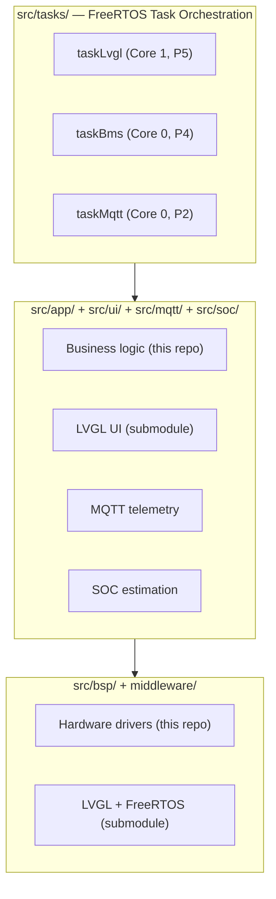

# BMSCoreESP32

[中文版](README_CN.md)

ESP32-S3 BMS (Battery Management System) integrated firmware — combining INA226 current/voltage sensing, LVGL display UI, MQTT telemetry, and OCV-SOC estimation on a single Freenove ESP32-S3 WROOM N16R8 board.

## Features

- **BMS Core**: INA226 current/voltage monitoring (2mOhm shunt, 15A max) + DAC8562 dual 16-bit analog output
- **LVGL UI**: 4-page MVC interface (SOC display, CCCV charging, CC discharging, system settings) on 1.14" ST7789 IPS display
- **MQTT Telemetry**: WiFi auto-config via WiFiManager captive portal + JSON telemetry reporting (voltage/current/SOC/temperature)
- **SOC Estimation**: OCV-SOC lookup table for LG 18650HG2 (13-point linear interpolation, integer math)
- **FreeRTOS Multi-task**: Dual-core scheduling — LVGL on Core 1, sensor + MQTT on Core 0

## Hardware

| Component | Spec |
|-----------|------|
| MCU | ESP32-S3 Xtensa LX7, 240MHz dual-core |
| Flash / PSRAM | 16MB / 8MB OPI |
| Display | 1.14" ST7789 IPS, 135x240, RGB565, SPI |
| Sensor | INA226, I2C, 2mOhm shunt, 15A max |
| DAC | DAC8562, dual 16-bit, dedicated SPI bus on the second general-purpose SPI host |
| WiFi | ESP32-S3 built-in 2.4GHz 802.11 b/g/n |

## Architecture



Three-layer decoupling: BSP drivers are injected into App via pointers, App and UI communicate through `bms_state_t` shared state. UI has zero hardware dependencies — reusable on PC simulator.

### FreeRTOS Tasks

| Task | Core | Priority | Stack | Period | Function |
|------|------|----------|-------|--------|----------|
| task_lvgl | 1 | 5 | 8KB | 5ms | LVGL display refresh |
| task_sensor | 0 | 4 | 4KB | 200ms | INA226 V/I reading, SOC lookup |
| task_mqtt | 0 | 2 | 6KB | 10ms | WiFi/MQTT maintenance, telemetry |

## Pin Assignment

Pin visualization spec: [Docs/PINOUT_VISUALIZATION.md](Docs/PINOUT_VISUALIZATION.md)  
Visualization metadata: [Docs/pinout_metadata.json](Docs/pinout_metadata.json)
Generate board-style interactive page: `python3 scripts/generate_pinout_board.py`

### I2C (INA226)
| Signal | GPIO |
|--------|------|
| SDA | 21 |
| SCL | 22 |

### SPI — ST7789 LCD (GP-SPI2 / FSPI)
| Signal | GPIO |
|--------|------|
| MOSI | 11 |
| SCLK | 12 |
| LCD_CS | 10 |
| LCD_DC | 46 |
| LCD_RST | 9 |
| LCD_BLK | 8 |

### SPI — DAC8562 (dedicated second general-purpose SPI host)
| Signal | GPIO |
|--------|------|
| DAC_MOSI | 40 |
| DAC_SCLK | 41 |
| DAC_SYNC | 14 |

On ESP32-S3 Arduino, this DAC bus uses the second general-purpose SPI host exposed as `HSPI`. The wiring stays dedicated to the DAC and remains separate from the LCD bus.

### Other
| Signal | GPIO | Note |
|--------|------|------|
| UART_RX | 18 | Reserved |
| UART_TX | 17 | Reserved |
| RGB_LED | 48 | WS2812 status |
| FLASH_BTN | 0 | WiFiManager reset |

> GPIO 35-37 are occupied by OPI PSRAM and cannot be used.

## Directory Structure

```
BMSCoreESP32/
├── boards/                         Custom board definition (N16R8)
├── Docs/                           Project documentation
├── include/
│   ├── pin_config.h                GPIO pin definitions
│   └── bms_config.h                System constants
├── middleware/                      Middleware (git submodules)
│   ├── lvgl/                       LVGL v9.5
│   └── FreeRTOS/                   FreeRTOS-Kernel
├── src/
│   ├── main.cpp                    Entry point + task creation
│   ├── tasks/                      FreeRTOS task implementations
│   ├── bsp/                        Hardware drivers (ported from STM32 HAL)
│   ├── app/                        Business logic
│   ├── ui/                         LVGL UI (submodule: lv_bms_view)
│   │   ├── src/view/               LVGL views (pure C)
│   │   ├── src/controller/         UI controllers (pure C)
│   │   ├── src/hw/                 Hardware abstraction bridge
│   │   └── fonts/                  Montserrat subset fonts
│   ├── mqtt/                       WiFi + MQTT telemetry
│   └── soc/                        SOC estimation (OCV lookup)
├── platformio.ini
└── lv_conf.h                       LVGL configuration
```

## Build

PlatformIO is not in PATH — use full path:

```bash
# Compile
~/.platformio/penv/bin/pio run

# Flash
~/.platformio/penv/bin/pio run -t upload

# Serial monitor
~/.platformio/penv/bin/pio device monitor
```

## Dependencies

| Library | Version | Source |
|---------|---------|--------|
| LVGL | v9.5 | `middleware/lvgl/` submodule |
| lv_bms_view | dev-esp32 | `src/ui/` submodule |
| FreeRTOS-Kernel | latest | `middleware/FreeRTOS/` submodule |
| ArduinoJson | ^7 | PlatformIO lib_deps |
| OneButton | ^2 | PlatformIO lib_deps |
| PubSubClient | ^2 | PlatformIO lib_deps |
| WiFiManager | v2.0.17 | PlatformIO lib_deps |

## MQTT Protocol

| Topic | Direction | Format | Period |
|-------|-----------|--------|--------|
| `bms/telemetry` | Uplink | JSON | 5s |
| `bms/command` | Downlink | JSON | On demand |

Telemetry payload:
```json
{
  "v_mv": 3700,
  "i_ma": 1500,
  "soc_x10": 850,
  "temp_x10": 250,
  "charge_active": true,
  "discharge_active": false
}
```

## WiFi Configuration

- WiFiManager captive portal — AP mode for initial setup
- AP SSID: `ESP32S3_BMS`
- Long-press FLASH button (>3s) to erase saved WiFi config
- Config stored in LittleFS `/config`

## Development Roadmap

- [x] Phase 1: PlatformIO project, submodules, BSP drivers, LVGL display init
- [x] Phase 2: BMS UI + business logic migration
- [x] Phase 3: INA226 sensor integration, SOC estimation
- [x] Phase 4: WiFiManager + MQTT telemetry
- [ ] Phase 5: DL-based SOC inference (1D-CNN, future)

## License

See [LICENCE.txt](middleware/lvgl/LICENCE.txt) for LVGL license terms.
