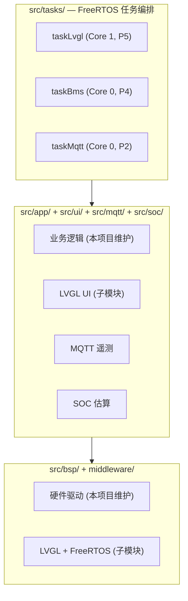

# BMSCoreESP32

[English](README.md)

ESP32-S3 BMS 集成固件 — 在一块 Freenove ESP32-S3 WROOM N16R8 开发板上整合 INA226 电流/电压监测、LVGL 显示 UI、MQTT 遥测和 OCV-SOC 估算。

## 特性

- **BMS 核心**: INA226 电流/电压监测 (2mOhm 分流器, 15A) + DAC8562 双通道 16-bit 模拟输出
- **LVGL UI**: 4 页面 MVC 界面 (SOC 显示、CCCV 充电、CC 放电、系统设置), 1.14" ST7789 IPS 屏
- **MQTT 遥测**: WiFiManager 一键配网 + JSON 遥测上报 (电压/电流/SOC/温度)
- **SOC 估算**: LG 18650HG2 OCV-SOC 查找表 (13 点线性插值, 纯整数运算)
- **FreeRTOS 多任务**: 双核调度 — Core 1 跑 LVGL 显示, Core 0 跑传感器 + MQTT

## 硬件

| 组件 | 规格 |
|------|------|
| MCU | ESP32-S3 Xtensa LX7, 240MHz 双核 |
| Flash / PSRAM | 16MB / 8MB OPI |
| 显示屏 | 1.14" ST7789 IPS, 135x240, RGB565, SPI |
| 传感器 | INA226, I2C, 2mOhm 分流器, 最大 15A |
| DAC | DAC8562, 双通道 16-bit, SPI3 (GP-SPI3/VSPI, 独立总线) |
| WiFi | ESP32-S3 内置 2.4GHz 802.11 b/g/n |

## 架构



三层解耦: BSP 驱动通过指针注入 App 层, App 与 UI 通过 `bms_state_t` 共享状态通信。UI 层零硬件依赖, 可直接在 PC 模拟器复用。

### FreeRTOS 任务

| 任务 | 核心 | 优先级 | 栈大小 | 周期 | 功能 |
|------|------|--------|--------|------|------|
| task_lvgl | 1 | 5 | 8KB | 5ms | LVGL 显示刷新 |
| task_sensor | 0 | 4 | 4KB | 200ms | INA226 读取, SOC 查表 |
| task_mqtt | 0 | 2 | 6KB | 10ms | WiFi/MQTT 维护, 遥测上报 |

## 引脚分配

### I2C (INA226)
| 信号 | GPIO |
|------|------|
| SDA | 21 |
| SCL | 22 |

### SPI — ST7789 LCD (GP-SPI2 / FSPI)
| 信号 | GPIO |
|------|------|
| MOSI | 11 |
| SCLK | 12 |
| LCD_CS | 10 |
| LCD_DC | 46 |
| LCD_RST | 9 |
| LCD_BLK | 8 |

### SPI — DAC8562 (GP-SPI3 / VSPI)
| 信号 | GPIO |
|------|------|
| DAC_MOSI | 40 |
| DAC_SCLK | 41 |
| DAC_SYNC | 14 |

### 其他
| 信号 | GPIO | 备注 |
|------|------|------|
| UART_RX | 18 | 预留 |
| UART_TX | 17 | 预留 |
| RGB_LED | 48 | WS2812 状态指示 |
| FLASH_BTN | 0 | WiFiManager 配置重置 |

> GPIO 35-37 被 OPI PSRAM 占用, 不可用。

## 目录结构

```
BMSCoreESP32/
├── boards/                         自定义板定义 (N16R8)
├── Docs/                           项目文档
├── include/
│   ├── pin_config.h                GPIO 引脚定义
│   └── bms_config.h                系统常量
├── middleware/                      中间件 (git 子模块)
│   ├── lvgl/                       LVGL v9.5
│   └── FreeRTOS/                   FreeRTOS-Kernel
├── src/
│   ├── main.cpp                    入口 + 任务创建
│   ├── tasks/                      FreeRTOS 任务实现
│   ├── bsp/                        硬件驱动 (从 STM32 HAL 移植)
│   ├── app/                        业务逻辑
│   ├── ui/                         LVGL UI (子模块: lv_bms_view)
│   │   ├── src/view/               LVGL 视图 (纯 C)
│   │   ├── src/controller/         UI 控制器 (纯 C)
│   │   ├── src/hw/                 硬件抽象桥接
│   │   └── fonts/                  Montserrat 子集字体
│   ├── mqtt/                       WiFi + MQTT 遥测
│   └── soc/                        SOC 估算 (OCV 查表)
├── platformio.ini
└── lv_conf.h                       LVGL 配置
```

## 构建

PlatformIO 未加入 PATH, 使用完整路径:

```bash
# 编译
~/.platformio/penv/bin/pio run

# 烧录
~/.platformio/penv/bin/pio run -t upload

# 串口监视器
~/.platformio/penv/bin/pio device monitor
```

## 依赖

| 库 | 版本 | 来源 |
|----|------|------|
| LVGL | v9.5 | `middleware/lvgl/` 子模块 |
| lv_bms_view | dev-esp32 | `src/ui/` 子模块 |
| FreeRTOS-Kernel | latest | `middleware/FreeRTOS/` 子模块 |
| ArduinoJson | ^7 | PlatformIO lib_deps |
| OneButton | ^2 | PlatformIO lib_deps |
| PubSubClient | ^2 | PlatformIO lib_deps |
| WiFiManager | v2.0.17 | PlatformIO lib_deps |

## MQTT 协议

| Topic | 方向 | 格式 | 周期 |
|-------|------|------|------|
| `bms/telemetry` | 上报 | JSON | 5s |
| `bms/command` | 下发 | JSON | 按需 |

遥测数据格式:
```json
{
  "v_mv": 3700,
  "i_ma": 1500,
  "soc_x10": 850,
  "temp_x10": 250,
  "charge_active": true,
  "discharge_active": false
}
```

## WiFi 配置

- WiFiManager 强制门户 — AP 模式一键配网
- AP 名称: `ESP32S3_BMS`
- 长按 FLASH 按钮 (>3s) 擦除已保存的 WiFi 配置
- 配置存储在 LittleFS `/config`

## 开发路线

- [x] Phase 1: PlatformIO 工程, 子模块, BSP 驱动, LVGL 显示初始化
- [x] Phase 2: BMS UI + 业务逻辑移植
- [x] Phase 3: INA226 传感器集成, SOC 估算
- [x] Phase 4: WiFiManager + MQTT 遥测
- [ ] Phase 5: DL SOC 推理 (1D-CNN, 未来)

## 许可证

LVGL 许可证详见 [LICENCE.txt](middleware/lvgl/LICENCE.txt)。
